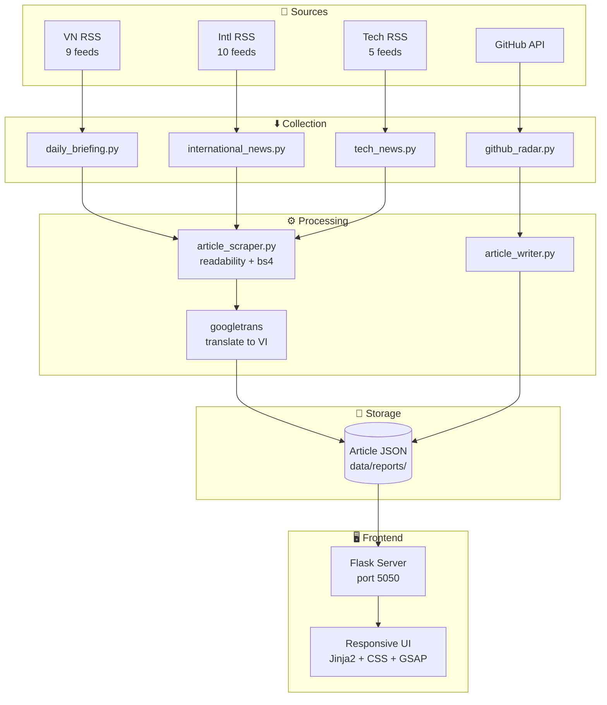

# Architecture



## Data Flow

1. **Collection** — Daily cronjobs trigger RSS collectors. Each script fetches from its configured feeds.
2. **Extraction** — Every RSS link is passed to `article_scraper.py`, which uses readability-lxml to extract clean article content. VnExpress-specific HTML wrappers are stripped.
3. **Translation** — International articles are translated to Vietnamese via googletrans before storage.
4. **Storage** — Each article is saved as an individual JSON file in `data/reports/`. No database required.
5. **Serving** — Flask server reads JSON files on demand, renders them through Jinja2 templates with a responsive CSS grid.
6. **Frontend** — GSAP animations enhance the reading experience. Dark mode uses CSS custom property swap.

## File Format

```json
{
  "id": "article_2026-07-03_hash",
  "title": "Vietnamese Article Title",
  "date": "2026-07-03",
  "category": "economic",
  "content_html": "<p>Cleaned article content...</p>",
  "lead_image": "https://example.com/image.jpg",
  "tags": ["kinh-tế", "thế-giới"],
  "source_url": "https://source.com/article",
  "word_count": 772
}
```

## Key Design Decisions

- **JSON instead of SQL** — Portable, zero-config, easy to backup and inspect
- **Filesystem as database** — Sufficient for personal/small-scale use. No database server needed
- **Stateless frontend** — Flask reads JSON on every request. No caching layer required at this scale
- **Semantic CSS tokens** — Colors defined in 3 layers (Primal → Semantic → Component). Dark mode swaps the semantic layer
