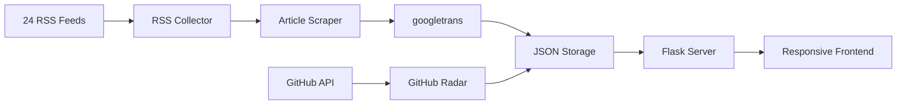

# The Agent Times

AI-powered self-hosted newspaper that crawls, translates, organizes and publishes daily news from around the world.

Reads full articles from 24 RSS feeds across 10 countries, extracts clean content, translates foreign news into Vietnamese, and presents them in a responsive newspaper-style frontend — all automated.

<p align="center">
  
  
  
  
  
  
  
</p>

## Screenshots

| Homepage (light) | Article Page | Category View |
|:---:|:---:|:---:|
|  |  |  |

| Mobile | Dark Theme |
|:---:|:---:|
|  |  |

## Features

### News Pipeline

- **RSS aggregation** — 24 feeds from 10 countries (US, UK, Japan, China, France, Germany, South Korea, Australia, Singapore, India) plus 9 Vietnamese sources (VnExpress, Tuổi Trẻ, VietnamNet)
- **Full article extraction** — Every RSS link is fetched, parsed, and cleaned. No headline-only summaries. VnExpress HTML wrappers and inline classes are stripped automatically.
- **Translation** — International articles are translated to Vietnamese via googletrans. Titles, descriptions, and full body content.
- **GitHub Radar** — Scans GitHub trending repos, filters for projects with 100+ stars, writes a full article per repo.
- **Date archive** — Browse any day's articles via calendar picker or prev/next navigation.
- **Full-text search** — Search across all articles, titles, tags, and categories.

### Frontend

- **Responsive design** — 3-column grid on desktop, single column on mobile (390px viewport supported).
- **Dark mode** — Full semantic theme swap. Navy-based dark palette (#0d1929). Persisted in localStorage.
- **Article sidebar** — Right column shows related article headlines. Click to navigate without returning to the homepage.
- **Animations** — GSAP-powered entrance sequences. Respects `prefers-reduced-motion`.
- **Navigation** — 8 category links in uppercase. Each filters articles server-side.

### Automation

- **6 daily cronjobs** — International news at 07:00, VN news at 08:00, AI writer at 08:30, GitHub radar at 09:00, F&B reports at 10:00.
- **Desktop launcher** — One-click `.desktop` shortcut starts the server and opens the browser.

## Why this project exists

Most news readers only aggregate RSS headlines. They show you a title and a link. You click, wait for the page to load, fight through cookie banners and popup ads, and eventually read the article.

The Agent Times reads the full article for you. It scrapes the content, strips the clutter, removes VnExpress-specific HTML classes, translates foreign articles into Vietnamese, and saves everything as a clean, searchable article — no ads, no banners, no pageload delay.

## Architecture



## Project Structure

```
the-agent-times/
├── frontend/              # Flask web application (port 5050)
│   ├── app.py             # Server + routes + article loader
│   ├── static/style.css   # Design tokens, dark/light theme
│   └── templates/         # Jinja2 templates (base, index, article)
├── scripts/               # Data collection & processing
│   ├── daily_briefing.py  # VN RSS collector (9 feeds)
│   ├── international_news.py  # 10-country RSS + translate
│   ├── tech_news.py       # Tech RSS (5 sources)
│   ├── article_scraper.py # Universal article extractor
│   ├── github_radar.py    # Trending repos scanner
│   └── github_article_writer.py  # Repo → article converter
├── data/reports/          # Article JSON files (auto-generated)
├── docs/                  # Screenshots, architecture diagrams
└── skills/                # AI agent design skills
```

## Quick Start

```bash
git clone https://github.com/Chillalot/the-agent-times.git
cd the-agent-times
pip install -r frontend/requirements.txt
cd frontend && python3 app.py
```

Open http://localhost:5050.

## Usage

### Generate Vietnamese News

```bash
cd scripts
python3 daily_briefing.py
```

Downloads 9 VN RSS feeds, extracts each article via article_scraper.py, saves clean HTML + images.

### Generate International News

```bash
python3 international_news.py          # All 10 countries
python3 international_news.py --country us,uk,france  # Specific countries
python3 international_news.py --country us --scrape   # With full content scraping
```

Articles are translated to Vietnamese via googletrans.

### Generate GitHub Articles

```bash
python3 github_radar.py
python3 github_article_writer.py
```

Scans GitHub trending, filters repos with 100+ stars, writes one article per repo.

### Scrape a Single Article

```bash
python3 article_scraper.py "https://vnexpress.net/example-article.html" economic
```

### Start the Server

```bash
cd frontend && python3 app.py
# http://localhost:5050
```

### Schedule Daily Cronjobs

```bash
07:00 — python3 international_news.py
08:00 — bash autoreport_daily.sh
08:30 — (AI news writer in Hermes Agent)
09:00 — bash autoreport_github.sh
10:00 — bash autoreport_fnb.sh
```

## Configuration

### RSS Feeds

Edit `FEEDS` dict at the top of each script:

```python
FEEDS = {
    "my-feed": {
        "name": "My Feed Name",
        "url": "https://example.com/rss",
        "category": "economic",
        "tags": ["my-tag"],
    },
}
```

### Categories

Add to `frontend/app.py`:

```python
CATEGORY_MAP["my-category"] = {"name": "📂 My Category", "emoji": "📂"}
```

Then add a nav link in `frontend/templates/base.html`.

### Themes

Edit CSS variables in `frontend/static/style.css`:

```css
:root {
  --accent: #032435;
  --max-width: 1040px;
  --font-heading: 'Be Vietnam Pro', sans-serif;
}
```

### Translation

googletrans is the default backend. To use a different translator, modify `translate_text()` in the relevant script.

## Roadmap

- [x] RSS aggregation (24 feeds, 10 countries)
- [x] Full article scraping + HTML cleanup
- [x] Vietnamese translation (googletrans)
- [x] GitHub trending radar (100+ stars)
- [x] Full-text search
- [ ] AI article summaries
- [ ] Docker Compose deployment
- [ ] Email newsletter delivery
- [ ] REST API for articles
- [ ] User-defined topic filters
- [ ] Mobile app (React Native)

## Design Principles

### Color

3-layer token system. Primitives define raw values (oklch). Semantic tokens map to component roles (--bg, --text, --accent). Components reference only semantic tokens.

### Spacing

4px base grid. Tighter spacing within groups (4-8px), wider between sections (24-48px). Proximity creates visual hierarchy — no heavy borders needed.

### Typography

5-level scale: Display (48px) → Micro (11px). Body width capped at 65 characters for readability. Headings use Be Vietnam Pro, body uses system-ui for better Vietnamese diacritic rendering.

### Animation

Only `transform` and `opacity` are animated. Durations range from 100ms (button presses) to 600ms (page entrances). Easing uses `cubic-bezier(0.25, 1, 0.5, 1)`. Respects `prefers-reduced-motion`.

## Contributing

Pull requests are welcome. For major changes, open an issue first.

- Add RSS feeds: edit `FEEDS` dict in the relevant script
- Add categories: update `CATEGORY_MAP` in `app.py` and the nav in `base.html`
- Fix scraping: the article scraper handles VnExpress-style sites; PRs for other site layouts are appreciated

See [CONTRIBUTING.md](CONTRIBUTING.md) for full guidelines.

## License

MIT — free for personal and commercial use.

## Credits

- [Design-Craft](https://github.com/FasalZein/design-craft) — Design principles for AI agents
- [Laws of UX](https://github.com/FasalZein/laws-of-ux) — UX psychology rules
- [GSAP](https://gsap.com) — Animation library
- [googletrans](https://pypi.org/project/googletrans/) — Translation backend
- [readability-lxml](https://github.com/burntsushi/readability-lxml) — Article extraction
- [Hermes Agent](https://hermes-agent.nousresearch.com) — AI agent runtime
