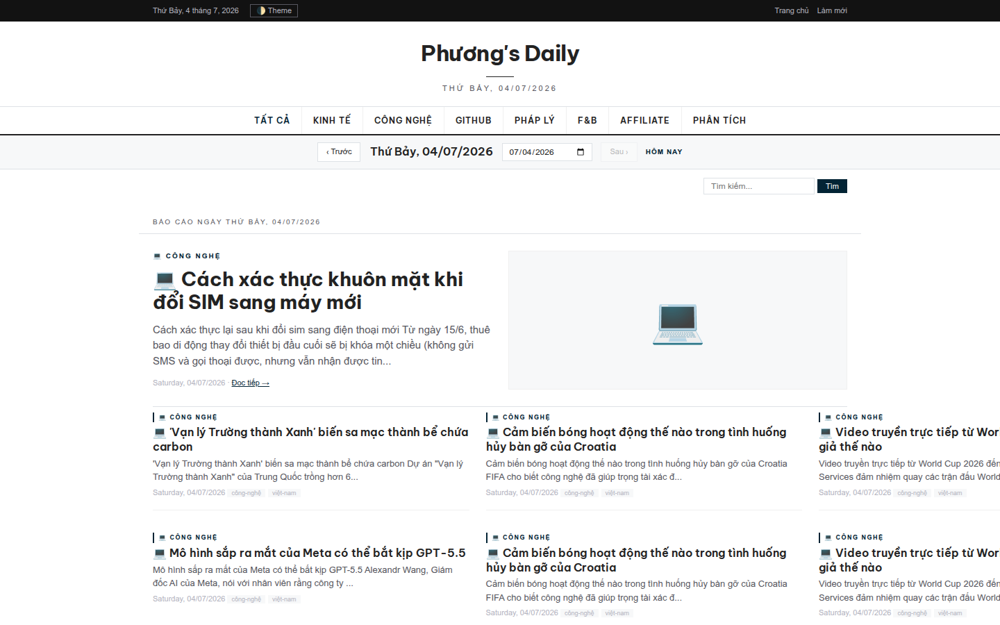
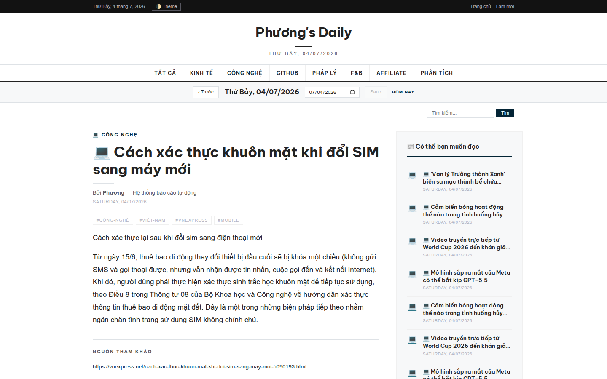
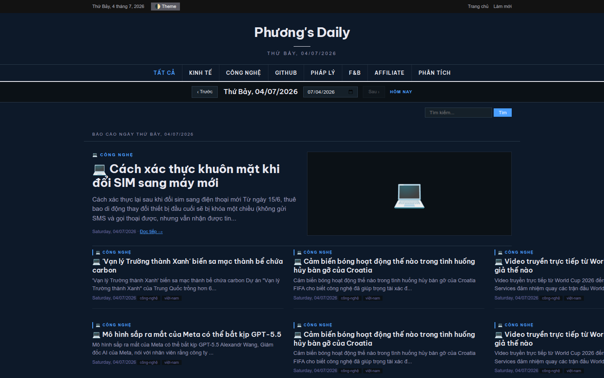
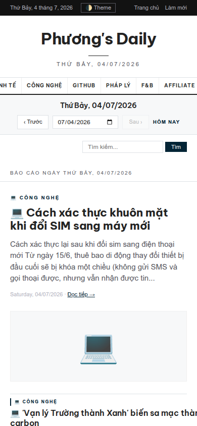
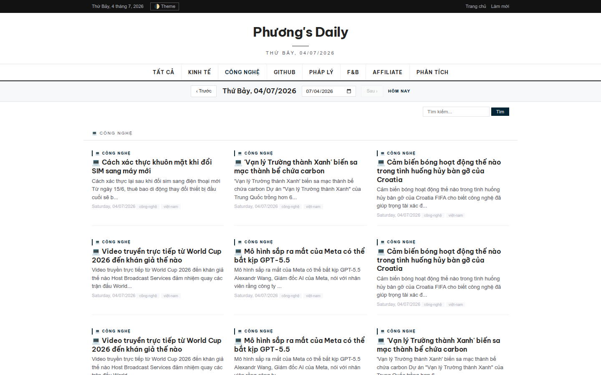
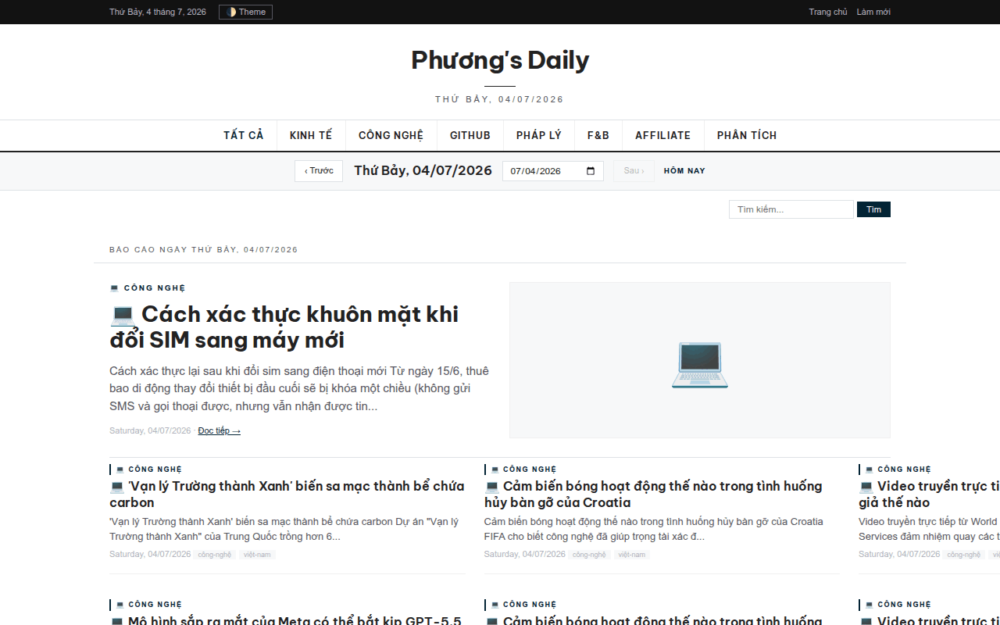
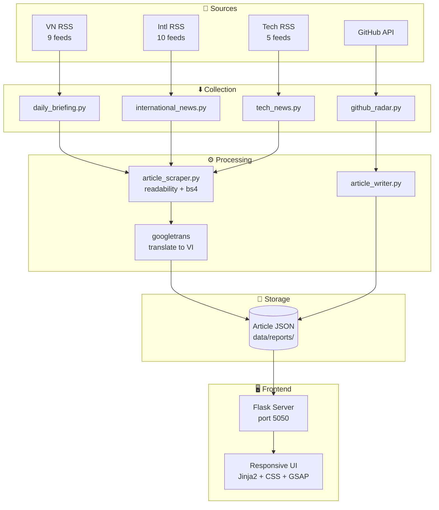

# The Agent Times

AI-powered self-hosted newspaper that crawls, translates, organizes and publishes daily news from around the world.

Reads full articles from 24 RSS feeds across 10 countries, extracts clean content, translates foreign news into Vietnamese, and presents them in a responsive newspaper-style frontend — all automated.

<p align="center">
  
  
  
  
  
  
  
</p>

## Highlights

- **24 RSS feeds** — 9 Vietnamese + 10 international + 5 tech
- **10 countries** — US, UK, Japan, China, France, Germany, South Korea, Australia, Singapore, India
- **Full article extraction** — not headlines, not summaries
- **Vietnamese translation** — international content translated automatically
- **GitHub Radar** — trending repos with 100+ stars
- **Self-hosted** — your data, your server
- **JSON storage** — portable, queryable, backup-friendly
- **Dark mode** — semantic theme swap, persisted

## Screenshots & Demo

| Homepage | Article Page | Dark Theme |
|:---:|:---:|:---:|
|  |  |  |

| Mobile | Technology |
|:---:|:---:|
|  |  |

### Demo



## Features

### News Pipeline

- **RSS aggregation** — 24 feeds from 10 countries plus 9 Vietnamese sources (VnExpress, Tuổi Trẻ, VietnamNet)
- **Full article extraction** — Every RSS link is fetched, parsed, and cleaned. VnExpress HTML wrappers and inline classes are stripped automatically.
- **Translation** — International articles are translated to Vietnamese via googletrans. Titles, descriptions, and full body content.
- **GitHub Radar** — Scans GitHub trending repos, filters for projects with 100+ stars, writes a full article per repo.
- **Date archive** — Browse any day's articles via calendar picker or prev/next navigation.
- **Full-text search** — Search across all articles, titles, tags, and categories.

### Frontend

- **Responsive design** — 3-column grid on desktop, single column on mobile (390px viewport supported).
- **Dark mode** — Full semantic theme swap. Navy-based dark palette (#0d1929). Persisted in localStorage.
- **Article sidebar** — Right column shows related article headlines. Click to navigate without returning to the homepage.
- **Animations** — GSAP-powered entrance sequences. Respects `prefers-reduced-motion`.
- **Navigation** — 8 category links in uppercase. Each filters articles server-side.

### Automation

- **6 daily cronjobs** — International news at 07:00, VN news at 08:00, AI writer at 08:30, GitHub radar at 09:00, F&B reports at 10:00.
- **Desktop launcher** — One-click `.desktop` shortcut starts the server and opens the browser.

## Why this project exists

Most news readers only aggregate RSS headlines. They show you a title and a link. You click, wait for the page to load, fight through cookie banners and popup ads, and eventually read the article.

The Agent Times reads the full article for you. It scrapes the content, strips the clutter, removes VnExpress-specific HTML classes, translates foreign articles into Vietnamese, and saves everything as a clean, searchable article — no ads, no banners, no pageload delay.

## Example Article

Here is what a scraped and cleaned article looks like internally:

```json
{
  "id": "article_2026-07-03_76c229cd",
  "title": "Ông Trump đã mua cổ phiếu Apple, Nvidia trước khi hoãn áp thuế",
  "date": "2026-07-03",
  "category": "legal",
  "lead_image": "https://i1-kinhdoanh.vnecdn.net/.../AP26166598955758.jpg",
  "word_count": 772,
  "tags": ["pháp-lý", "công-nghệ", "thế-giới"],
  "content_html": "<figure></figure><p>...</p>",
  "source_url": "https://vnexpress.net/example-article"
}
```

The JSON format makes the archive portable — backup, query, or process with external tools.

## Architecture



## Project Structure

```
the-agent-times/
├── frontend/              # Flask web application (port 5050)
│   ├── app.py             # Server + routes + article loader
│   ├── static/style.css   # Design tokens, dark/light theme
│   └── templates/         # Jinja2 templates
├── scripts/               # Data collection & processing
│   ├── daily_briefing.py  # VN RSS collector (9 feeds)
│   ├── international_news.py  # 10-country RSS + translate
│   ├── tech_news.py       # Tech RSS (5 sources)
│   ├── article_scraper.py # Universal article extractor
│   ├── github_radar.py    # Trending repos scanner
│   └── github_article_writer.py  # Repo → article converter
├── data/reports/          # Article JSON files (auto-generated)
├── docs/                  # Screenshots, architecture, GIFs
└── skills/                # AI agent design skills
```

## Tech Stack

| Layer | Technology |
|-------|-----------|
| Backend | Python 3.11+, Flask 3.0+ |
| Templates | Jinja2 |
| RSS Parsing | Feedparser, xml.etree |
| Article Extraction | readability-lxml, BeautifulSoup |
| Translation | googletrans |
| Animation | GSAP (JavaScript) |
| AI Agent Runtime | Hermes Agent |

## Quick Start

```bash
git clone https://github.com/Chillalot/the-agent-times.git
cd the-agent-times
python3 -m venv .venv
source .venv/bin/activate
pip install -r frontend/requirements.txt
python3 frontend/app.py
```

Open http://localhost:5050.

## Usage

### Generate Vietnamese News

```bash
cd scripts
python3 daily_briefing.py
```

Downloads 9 VN RSS feeds, extracts each article via article_scraper.py, saves clean HTML + images.

### Generate International News

```bash
python3 international_news.py                    # All 10 countries
python3 international_news.py --country us,uk    # Specific countries
python3 international_news.py --country us --scrape  # With full content
```

Articles are translated to Vietnamese via googletrans.

### Generate GitHub Articles

```bash
python3 github_radar.py
python3 github_article_writer.py
```

Scans GitHub trending, filters repos with 100+ stars, writes one article per repo.

### Scrape a Single Article

```bash
python3 article_scraper.py "https://vnexpress.net/example" economic
```

### Start the Server

```bash
cd frontend && python3 app.py
# → http://localhost:5050
```

### Schedule Daily Automation

```bash
07:00 — International news
08:00 — VN news + scrape
08:30 — AI news writer
09:00 — GitHub radar
10:00 — F&B reports
```

## Configuration

### RSS Feeds

Edit the `FEEDS` dict at the top of each script:

```python
FEEDS = {
    "my-feed": {
        "name": "My Feed",
        "url": "https://example.com/rss",
        "category": "economic",
        "tags": ["my-tag"],
    },
}
```

### Categories

Add to `frontend/app.py`:

```python
CATEGORY_MAP["my-cat"] = {"name": "📂 My Category", "emoji": "📂"}
```

Then add a nav link in `frontend/templates/base.html`.

### Themes

Edit CSS variables in `frontend/static/style.css`:

```css
:root {
  --accent: #032435;
  --max-width: 1040px;
}
```

### Translation

googletrans is the default. To use a different backend, modify `translate_text()` in the relevant script. No API key required for googletrans.

## FAQ

**Why JSON instead of SQL?** JSON files are portable, easy to inspect, trivial to back up, and require zero database setup. The dataset is small enough that filesystem reads are fast.

**Does translation require an API key?** No. googletrans is a free library — no API key, no rate limiting for personal use.

**Can I add my own RSS feeds?** Yes. Add a new entry to the `FEEDS` dict in any script. See the Configuration section.

**Can I deploy with Docker?** Not yet, but it's on the roadmap.

**How do I change the design?** All visual tokens are in `frontend/static/style.css`. Colors, fonts, spacing, and layout are governed by CSS custom properties.

## Roadmap

- [x] RSS aggregation (24 feeds, 10 countries)
- [x] Full article scraping + HTML cleanup
- [x] Vietnamese translation
- [x] GitHub trending radar (100+ stars)
- [x] Full-text search
- [x] Dark mode
- [ ] AI article summaries
- [ ] Docker Compose deployment
- [ ] Email newsletter delivery
- [ ] REST API
- [ ] User-defined topic filters
- [ ] Mobile app

## Design Principles

| Principle | Implementation |
|-----------|---------------|
| Color | 3-layer tokens: Primitives → Semantic → Component |
| Typography | 5-level scale (48px → 11px), 65ch body width |
| Spacing | 4px base grid, proximity over borders |
| Motion | Only `transform` + `opacity`, `prefers-reduced-motion` respected |
| Dark mode | Semantic token swap, navy palette |

## Contributing

Pull requests welcome. For major changes, open an issue first.

- **Add feeds** — edit `FEEDS` dict in the relevant script
- **Add categories** — update `CATEGORY_MAP` in `app.py` + nav in `base.html`
- **Fix scraping** — `article_scraper.py` handles VnExpress-style sites; PRs for other layouts appreciated

See [CONTRIBUTING.md](CONTRIBUTING.md) for full guidelines.

## License

MIT — free for personal and commercial use.

## Credits

### Libraries
- readability-lxml — Article extraction
- BeautifulSoup — HTML parsing
- googletrans — Translation backend
- GSAP — Frontend animations
- Flask — Web server

### Design Inspiration
- NYT — Typography and layout
- Axios — Card design and whitespace
- VnExpress — Vietnamese news layout patterns

### AI Tools
- Hermes Agent — Cron scheduler and subagent orchestration
- Design-Craft — Design principles for AI agents
- Laws of UX — Psychology-driven interface constraints
- AI Website Cloner Template — Website cloning methodology

---

*This repository's documentation, screenshots, architecture diagrams, and demo assets are automatically generated and maintained by the `documentation-master` skill for Hermes Agent.*
