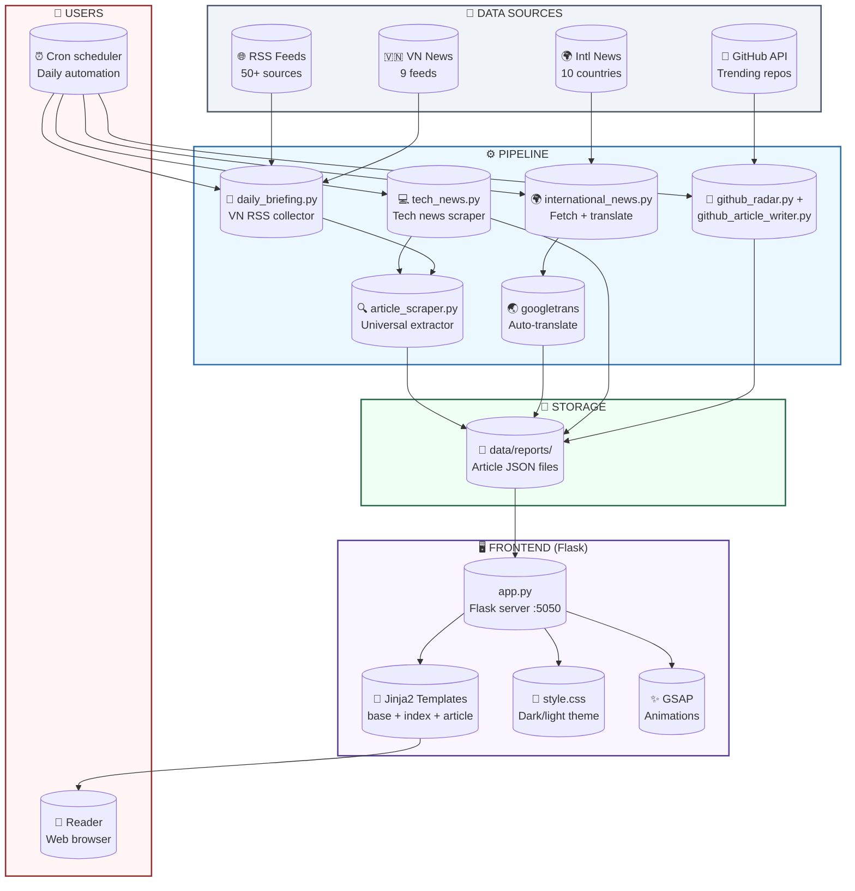

```mermaid
graph TB
    subgraph Sources["📡 DATA SOURCES"]
        RSS[("🌐 RSS Feeds<br/>50+ sources")]
        GITHUB[("🐙 GitHub API<br/>Trending repos")]
        VN[("🇻🇳 VN News<br/>9 feeds")]
        INT[("🌍 Intl News<br/>10 countries")]
    end

    subgraph Pipeline["⚙️ PIPELINE"]
        DB[("📰 daily_briefing.py<br/>VN RSS collector")]
        INTL[("🌍 international_news.py<br/>Fetch + translate")]
        TECH[("💻 tech_news.py<br/>Tech news scraper")]
        GH[("🐙 github_radar.py +<br/>github_article_writer.py")]
        SCRAPER[("🔍 article_scraper.py<br/>Universal extractor")]
        TRANS[("🌏 googletrans<br/>Auto-translate")]
    end

    subgraph Storage["💾 STORAGE"]
        JSON[("📁 data/reports/<br/>Article JSON files")]
    end

    subgraph Frontend["🖥️ FRONTEND (Flask)"]
        APP[("app.py<br/>Flask server :5050")]
        TEMPLATES[("📄 Jinja2 Templates<br/>base + index + article")]
        CSS[("🎨 style.css<br/>Dark/light theme")]
        GSAP[("✨ GSAP<br/>Animations")]
    end

    subgraph Users["👥 USERS"]
        READER[("📖 Reader<br/>Web browser")]
        SCHEDULER[("⏰ Cron scheduler<br/>Daily automation")]
    end

    RSS --> DB
    VN --> DB
    INT --> INTL
    TECH --> SCRAPER
    DB --> SCRAPER
    SCRAPER --> JSON
    INTL --> TRANS
    TRANS --> JSON
    TECH --> JSON
    GITHUB --> GH
    GH --> JSON
    JSON --> APP
    APP --> TEMPLATES
    APP --> CSS
    APP --> GSAP
    TEMPLATES --> READER
    SCHEDULER --> DB
    SCHEDULER --> INTL
    SCHEDULER --> TECH
    SCHEDULER --> GH

    style Sources fill:#f0f4f8,stroke:#4a5568,stroke-width:2px
    style Pipeline fill:#ebf8ff,stroke:#2b6cb0,stroke-width:2px
    style Storage fill:#f0fff4,stroke:#276749,stroke-width:2px
    style Frontend fill:#faf5ff,stroke:#553c9a,stroke-width:2px
    style Users fill:#fff5f5,stroke:#9b2c2c,stroke-width:2px
```
